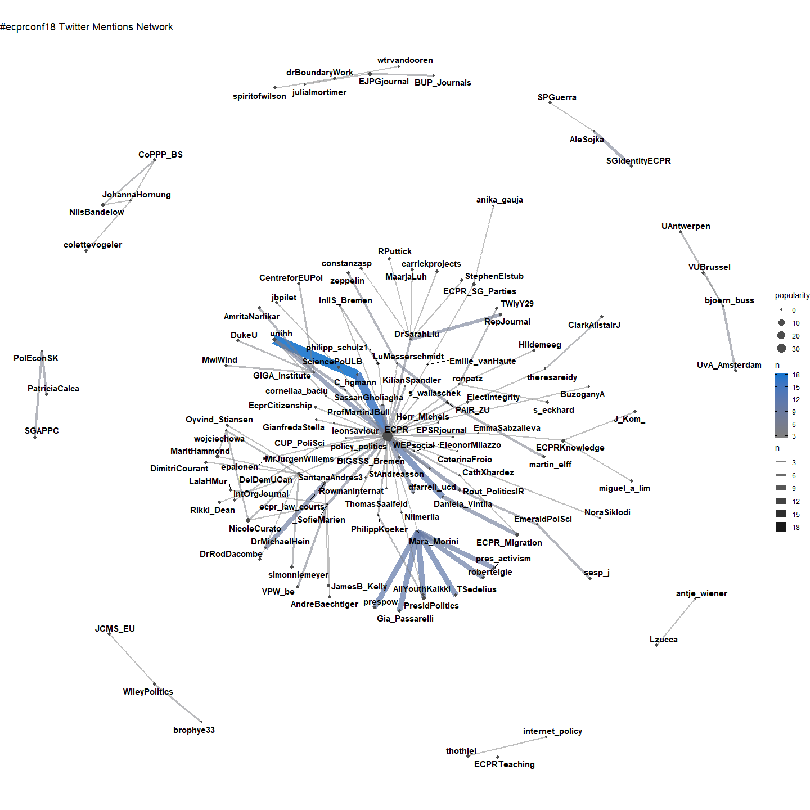

ECPR Conference 2018 Twitter Analysis
================
Fabio
2018-08-25

This is a short notebook outlining the code used to scrape tweets
related to the ECPR Conference 2018 in Hamburg.

## Packages

Load the necessary packages

``` r
# install pacman once if not avaible on your machine
# install.packages("pacman")

pacman::p_load(tidyverse, purrr, tidyr, rtweet, stringr, ggraph, igraph, tidygraph, forcats)
```

## Get Data

Call Twitter API. If you want to scrape data yourself you have to
register a free account where you get your personal access point to
Twitter. Check out [`rtweet`](https://github.com/mkearney/rtweet/) on
github and follow their instructions to the twitter authentication.

``` r
twitter_token <- readRDS("twitter_token.rds")

rt <- search_tweets(
  "#ecprconf18 OR #ecprconf2018", n = 5000, include_rts = F, retryonratelimit = T
)
save(rt, file = "data/rt.Rdata")
```

Lets first look at the data structure and column names. Twitter returns
over 1,200 unique tweets.

``` r
load("data/rt.Rdata")

rt %>% glimpse # the same as str, returns a df overview
```

    ## Observations: 1,399
    ## Variables: 88
    ## $ user_id                 <chr> "21951668", "21951668", "21951668", "2...
    ## $ status_id               <chr> "1033324994552573952", "10325642035535...
    ## $ created_at              <dttm> 2018-08-25 12:07:31, 2018-08-23 09:44...
    ## $ screen_name             <chr> "akreppel", "akreppel", "akreppel", "a...
    ## $ text                    <chr> "While the croissants can be treachero...
    ## $ source                  <chr> "Twitter for iPhone", "Twitter for iPa...
    ## $ display_text_width      <dbl> 92, 110, 37, 126, 215, 165, 158, 32, 2...
    ## $ reply_to_status_id      <chr> NA, "1032375076652347393", NA, NA, NA,...
    ## $ reply_to_user_id        <chr> NA, "21951668", NA, NA, NA, NA, NA, NA...
    ## $ reply_to_screen_name    <chr> NA, "akreppel", NA, NA, NA, NA, NA, NA...
    ## $ is_quote                <lgl> FALSE, FALSE, FALSE, FALSE, FALSE, FAL...
    ## $ is_retweet              <lgl> FALSE, FALSE, FALSE, FALSE, FALSE, FAL...
    ## $ favorite_count          <int> 0, 2, 5, 2, 14, 9, 0, 2, 5, 5, 5, 2, 8...
    ## $ retweet_count           <int> 0, 0, 0, 0, 5, 5, 0, 0, 4, 1, 1, 2, 2,...
    ## $ hashtags                <list> ["ecprconf18", "ECPRconf2018", "ecprc...
    ## $ symbols                 <list> [NA, NA, NA, NA, NA, NA, NA, NA, NA, ...
    ## $ urls_url                <list> [NA, NA, NA, NA, "ecpr.eu/Events/Pane...
    ## $ urls_t.co               <list> [NA, NA, NA, NA, "https://t.co/KIzaT3...
    ## $ urls_expanded_url       <list> [NA, NA, NA, NA, "https://ecpr.eu/Eve...
    ## $ media_url               <list> [NA, NA, NA, NA, "http://pbs.twimg.co...
    ## $ media_t.co              <list> [NA, NA, NA, NA, "https://t.co/4Els2K...
    ## $ media_expanded_url      <list> [NA, NA, NA, NA, "https://twitter.com...
    ## $ media_type              <list> [NA, NA, NA, NA, "photo", NA, "photo"...
    ## $ ext_media_url           <list> [NA, NA, NA, NA, "http://pbs.twimg.co...
    ## $ ext_media_t.co          <list> [NA, NA, NA, NA, "https://t.co/4Els2K...
    ## $ ext_media_expanded_url  <list> [NA, NA, NA, NA, "https://twitter.com...
    ## $ ext_media_type          <chr> NA, NA, NA, NA, NA, NA, NA, NA, NA, NA...
    ## $ mentions_user_id        <list> [NA, NA, NA, NA, NA, "49383083", NA, ...
    ## $ mentions_screen_name    <list> [NA, NA, NA, NA, NA, "ulrikeguerot", ...
    ## $ lang                    <chr> "en", "en", "en", "en", "en", "en", "e...
    ## $ quoted_status_id        <chr> NA, NA, NA, NA, NA, NA, NA, NA, "10329...
    ## $ quoted_text             <chr> NA, NA, NA, NA, NA, NA, NA, NA, "\"Rev...
    ## $ quoted_created_at       <dttm> NA, NA, NA, NA, NA, NA, NA, NA, 2018-...
    ## $ quoted_source           <chr> NA, NA, NA, NA, NA, NA, NA, NA, "Twitt...
    ## $ quoted_favorite_count   <int> NA, NA, NA, NA, NA, NA, NA, NA, 12, NA...
    ## $ quoted_retweet_count    <int> NA, NA, NA, NA, NA, NA, NA, NA, 3, NA,...
    ## $ quoted_user_id          <chr> NA, NA, NA, NA, NA, NA, NA, NA, "18984...
    ## $ quoted_screen_name      <chr> NA, NA, NA, NA, NA, NA, NA, NA, "Lafle...
    ## $ quoted_name             <chr> NA, NA, NA, NA, NA, NA, NA, NA, "Jean-...
    ## $ quoted_followers_count  <int> NA, NA, NA, NA, NA, NA, NA, NA, 497, N...
    ## $ quoted_friends_count    <int> NA, NA, NA, NA, NA, NA, NA, NA, 356, N...
    ## $ quoted_statuses_count   <int> NA, NA, NA, NA, NA, NA, NA, NA, 335, N...
    ## $ quoted_location         <chr> NA, NA, NA, NA, NA, NA, NA, NA, "Belgi...
    ## $ quoted_description      <chr> NA, NA, NA, NA, NA, NA, NA, NA, "Assoc...
    ## $ quoted_verified         <lgl> NA, NA, NA, NA, NA, NA, NA, NA, FALSE,...
    ## $ retweet_status_id       <chr> NA, NA, NA, NA, NA, NA, NA, NA, NA, NA...
    ## $ retweet_text            <chr> NA, NA, NA, NA, NA, NA, NA, NA, NA, NA...
    ## $ retweet_created_at      <dttm> NA, NA, NA, NA, NA, NA, NA, NA, NA, N...
    ## $ retweet_source          <chr> NA, NA, NA, NA, NA, NA, NA, NA, NA, NA...
    ## $ retweet_favorite_count  <int> NA, NA, NA, NA, NA, NA, NA, NA, NA, NA...
    ## $ retweet_retweet_count   <int> NA, NA, NA, NA, NA, NA, NA, NA, NA, NA...
    ## $ retweet_user_id         <chr> NA, NA, NA, NA, NA, NA, NA, NA, NA, NA...
    ## $ retweet_screen_name     <chr> NA, NA, NA, NA, NA, NA, NA, NA, NA, NA...
    ## $ retweet_name            <chr> NA, NA, NA, NA, NA, NA, NA, NA, NA, NA...
    ## $ retweet_followers_count <int> NA, NA, NA, NA, NA, NA, NA, NA, NA, NA...
    ## $ retweet_friends_count   <int> NA, NA, NA, NA, NA, NA, NA, NA, NA, NA...
    ## $ retweet_statuses_count  <int> NA, NA, NA, NA, NA, NA, NA, NA, NA, NA...
    ## $ retweet_location        <chr> NA, NA, NA, NA, NA, NA, NA, NA, NA, NA...
    ## $ retweet_description     <chr> NA, NA, NA, NA, NA, NA, NA, NA, NA, NA...
    ## $ retweet_verified        <lgl> NA, NA, NA, NA, NA, NA, NA, NA, NA, NA...
    ## $ place_url               <chr> NA, NA, NA, NA, NA, NA, NA, NA, "https...
    ## $ place_name              <chr> NA, NA, NA, NA, NA, NA, NA, NA, "Hambu...
    ## $ place_full_name         <chr> NA, NA, NA, NA, NA, NA, NA, NA, "Hambu...
    ## $ place_type              <chr> NA, NA, NA, NA, NA, NA, NA, NA, "city"...
    ## $ country                 <chr> NA, NA, NA, NA, NA, NA, NA, NA, "Germa...
    ## $ country_code            <chr> NA, NA, NA, NA, NA, NA, NA, NA, "DE", ...
    ## $ geo_coords              <list> [<NA, NA>, <NA, NA>, <NA, NA>, <NA, N...
    ## $ coords_coords           <list> [<NA, NA>, <NA, NA>, <NA, NA>, <NA, N...
    ## $ bbox_coords             <list> [<NA, NA, NA, NA, NA, NA, NA, NA>, <N...
    ## $ status_url              <chr> "https://twitter.com/akreppel/status/1...
    ## $ name                    <chr> "(((Amie Kreppel)))", "(((Amie Kreppel...
    ## $ location                <chr> "Florida, USA", "Florida, USA", "Flori...
    ## $ description             <chr> "Jean Monnet Chair and Associate Profe...
    ## $ url                     <chr> NA, NA, NA, NA, "https://t.co/MslGy2Ml...
    ## $ protected               <lgl> FALSE, FALSE, FALSE, FALSE, FALSE, FAL...
    ## $ followers_count         <int> 296, 296, 296, 296, 1245, 1245, 1245, ...
    ## $ friends_count           <int> 355, 355, 355, 355, 475, 475, 475, 475...
    ## $ listed_count            <int> 12, 12, 12, 12, 85, 85, 85, 85, 109, 1...
    ## $ statuses_count          <int> 2789, 2789, 2789, 2789, 8805, 8805, 88...
    ## $ favourites_count        <int> 3980, 3980, 3980, 3980, 0, 0, 0, 0, 24...
    ## $ account_created_at      <dttm> 2009-02-26 01:23:21, 2009-02-26 01:23...
    ## $ verified                <lgl> FALSE, FALSE, FALSE, FALSE, FALSE, FAL...
    ## $ profile_url             <chr> NA, NA, NA, NA, "https://t.co/MslGy2Ml...
    ## $ profile_expanded_url    <chr> NA, NA, NA, NA, "http://www.jaruizso.e...
    ## $ account_lang            <chr> "en", "en", "en", "en", "en", "en", "e...
    ## $ profile_banner_url      <chr> "https://pbs.twimg.com/profile_banners...
    ## $ profile_background_url  <chr> "http://abs.twimg.com/images/themes/th...
    ## $ profile_image_url       <chr> "http://pbs.twimg.com/profile_images/2...

The top ten retweeted tweets.

``` r
# load("rt.Rdata")
rt %>% 
  select(screen_name, text, retweet_count) %>% 
  filter(!str_detect(text, "^RT")) %>% 
  mutate(text = str_replace_all(text, "\\\n", " ")) %>% 
  arrange(desc(retweet_count)) %>% 
  top_n(n = 10) %>% 
  knitr::kable(., format = "markdown")
```

| screen\_name     | text                                                                                                                                                                                                                                                                                                                   | retweet\_count |
| :--------------- | :--------------------------------------------------------------------------------------------------------------------------------------------------------------------------------------------------------------------------------------------------------------------------------------------------------------------- | -------------: |
| jrteruel         | Cataluña y Escocia no son tan parecidas\! Un análisis de discurso halla notables diferencias entre independentismos: recurrente retórica populista en Cat, pero no en Esc. Interesante esto d @josejolivas presentado en el panel de @\_ignaciomolina <https://t.co/DuGF8ppfq6> \#ecprconf18 <https://t.co/OAh4CMMlqc> |             64 |
| policy\_politics | A special issue challenging scholars of policy theory to change the way they produce and communicate research. Read it for free until 20 September: <https://t.co/iaMl4s08C6> \#ecprconf18 @ECPR @CairneyPaul @chris\_weible <https://t.co/TsQBSlfN6T>                                                                 |             27 |
| DelDemUCan       | The countdown begins for the \#ecprconf18 in Hamburg\! Section conveners @NicoleCurato & @\_SofieMarien put together a schedule of democratic innovations panels here. Check it out <https://t.co/e8PVzo8foA> <https://t.co/kfEwLE6swv>                                                                                |             23 |
| BJPolS           | We are pleased to offer free access to a selection of the most-cited BJPolS articles until the end of 2018: <https://t.co/G2wKHDnTdL> \#ecprconf18 <https://t.co/rR7uPOwgCS>                                                                                                                                           |             20 |
| antje\_wiener    | Delighted to see the book published: \#Contestation and \#Constitution of \#Norms in \#GlobalIR ⁦ ⁦@CUP\_PoliSci⁩ ⁦@CUP\_Law⁩ ⁦@InternatlTheory⁩ ⁦@JacquiTrue⁩ @SassanGholiagha⁩ ⁦@JuttaBrunnee⁩ @womenalsoknow⁩ \#ecprconf18 <https://t.co/IbZUclVRpd>                                                                |             19 |
| CUP\_PoliSci     | Do you want to know what to do with your first book proposal? Read a series of blog posts from a @CambridgeUP Publisher: <https://t.co/vGFEmb3r48> \#ecprconf18 <https://t.co/Z34hmGWfSe>                                                                                                                              |             18 |
| ECPR             | Are you joining us at the University of Hamburg for \#ecprconf18? Rejoice\! The printed programme is now available to view online <https://t.co/GN8e81PaXx> <https://t.co/4lZBbhLxV0>                                                                                                                                  |             16 |
| LauraSeelkopf    | And here is the detailed programme of our section on the politics of taxation \#ecprconf18 : come and listen to 7 panels with 32 papers written by 48 scholars from 40 different institutions and four continents <https://t.co/1ZcM1No3ck>                                                                            |             14 |
| sarahcpolitics   | Presenting at \#ecprconf18 paper on political protest in the context of the global financial crisis. I find the crisis triggered mobilisations, but depressed participation trends more broadly. Saturday 2pm VMP 5, Rm 2067. @ValuesStudies. Download the paper: <https://t.co/TlPdTydQdf> <https://t.co/PzzAPiPrYp>  |             14 |
| kimgron          | The \#ecprconf18 starts on Thursday in Hamburg. We have a full \#DemInno section 👍 Also, don’t miss the Standing Group on Democratic Innovations meeting on Friday at 1 pm, Building VMP 8, Room 105. Steering Committee candidates will present themselves there, election in September                               |             14 |

## Timeline

What was the best time to tweet?

``` r
rt %>%
  ## parse date format
  mutate(
    cdate = created_at %>% 
      str_extract("\\d{4}-\\d{2}-\\d{2}") %>% 
      lubridate::ymd(),
    hour = lubridate::hour(created_at)
  ) %>%
  ## select relevant time period
  filter(cdate >= as.Date("2018-08-23")) %>% 
  ## count tweet per and and hour
  group_by(cdate, hour) %>%
  tally %>%
  ungroup %>%
  ggplot(aes(hour, n)) +
  geom_line() +
  ## split the visualization 
  facet_wrap(~cdate, ncol = 1) +
  theme_minimal() +
  ggtitle("Number of Tweets by Day and Hour") +
  xlab("Hour of the Day") +
  ylab("Number of Tweets")
```

<!-- -->

## Retweet Network

``` r
rt_graph <- rt %>% 
  ## select relevant variables
  dplyr::select(screen_name, mentions_screen_name) %>% 
  ## unnest list of mentions_screen_name
  unnest %>% 
  ## count the number of coocurences
  group_by(screen_name, mentions_screen_name) %>% 
  tally(sort = T) %>%
  ungroup %>% 
  ## drop missing values
  drop_na %>% 
  ## fliter those coocurences that appear at least 2 times
  filter(n > 1) %>% 
  ## transforming the dataframe to a graph object
  as_tbl_graph() %>% 
  ## calculating node centrality
  mutate(popularity = centrality_degree(mode = 'in'))

rt_graph %>% 
  ## create graph layout
  ggraph(layout = "kk") + 
  ## define edge aestetics
  geom_edge_fan(aes(alpha = n, edge_width = n, color = n)) + 
  ## scale down link saturation
  scale_edge_alpha(range = c(.5, .9)) +
  ## define note size param
  scale_edge_color_gradient(low = "gray50", high = "#1874CD") +
  geom_node_point(aes(size = popularity), color = "gray30") +
  ## equal width and height
  coord_fixed() +
  ## plain theme
  theme_void() +
  ## title
  ggtitle("#ecprconf18 Twitter Mentions Network")
```

<!-- -->

``` r
rt_graph %>% 
  ## create graph layout
  ggraph(layout = "kk") + 
  ## define edge aestetics
  geom_edge_fan(aes(alpha = n, edge_width = n, color = n)) + 
  ## scale down link saturation
  scale_edge_alpha(range = c(.5, .9)) +
  ## define note size param
  scale_edge_color_gradient(low = "gray50", high = "#1874CD") +
  geom_node_point(aes(size = popularity), color = "gray30") +
  ## define node labels
  geom_node_text(aes(label = name), repel = T, fontface = "bold") +
  ## equal width and height
  coord_fixed() +
  ## plain theme
  theme_void() +
  ## title
  ggtitle("#ecprconf18 Twitter Mentions Network")
```

<!-- -->

``` r
rt_graph %>% 
  ## create graph layout
  ggraph(layout = "circle") + 
  ## define edge aestetics
  geom_edge_fan(aes(alpha = n, edge_width = n, color = n)) + 
  ## scale down link saturation
  scale_edge_alpha(range = c(.5, .9)) +
  ## define note size param
  scale_edge_color_gradient(low = "gray50", high = "#1874CD") +
  geom_node_point(aes(size = popularity), color = "gray30") +
  ## define node labels
  geom_node_text(aes(label = name), repel = F, fontface = "bold") +
  ## equal width and height
  coord_fixed() +
  ## plain theme
  theme_void() +
  ## title
  ggtitle("#ecprconf18 Twitter Mentions Network")
```

<!-- -->

## Most Frequent Hashtags

``` r
rt_hashtags <- rt %>% 
  select(hashtags) %>% 
  ## unnest list of hastags
  unnest %>% 
    na.omit %>% 
  ## clean hashtags
  mutate(hashtags = stringr::str_to_lower(hashtags) %>% 
           str_replace_all("2018", "18") %>% 
           ## add #symbol to vector
           paste0("#", .)) %>% 
  ## count each hashtag and sort
  count(hashtags, sort = T) %>% 
  filter(n > 5)

rt_hashtags %>% 
  filter(hashtags != "#ecprconf18") %>%
  mutate(hashtags = forcats::fct_reorder(hashtags, n)) %>% 
  ggplot(aes(hashtags, n)) +
  geom_bar(stat = "identity", alpha = .7) +
  coord_flip() +
  theme_minimal() +
  ggtitle("Most Frequent Hastags related to #ecprconf18")
```

<!-- -->

## Most Frequent Bigram Network

``` r
gg_bigram <- rt %>%
  select(text) %>% 
  ## remove text noise
  mutate(text = stringr::str_remove_all(text, "w |amp ")) %>% 
  ## remove retweets
  filter(!stringr::str_detect(text, "^RT")) %>% 
  ## remove urls
  mutate(text = stringr::str_remove_all(text, "https?[:]//[[:graph:]]+")) %>% 
  mutate(id = 1:n()) %>% 
  ## split text into words
  tidytext::unnest_tokens(word, text, token = "words") %>% 
  ## remove stop words
  anti_join(tidytext::stop_words) %>% 
  ## paste words to text by id
  group_by(id) %>% 
  summarise(text = paste(word, collapse = " ")) %>% 
  ungroup %>% 
  ## again split text into bigrams (word occurences or collocations)
  tidytext::unnest_tokens(bigram, text, token = "ngrams", n = 2) %>% 
  separate(bigram, c("word1", "word2"), sep = " ") %>% 
  ## remove the hashtag and count bigrams 
  filter(word1 != "ecprconf18", word2 != "ecprconf18") %>%
  count(word1, word2, sort = T) %>% 
  ## select first 100
  slice(1:100) %>% 
  drop_na() %>%
  ## create tidy graph object
  as_tbl_graph() %>% 
  ## calculate node centrality
  mutate(Popularity = centrality_degree(mode = 'in'))
```

``` r
gg_bigram %>% 
  ggraph() +
  geom_edge_link(aes(edge_alpha = n, edge_width = n)) +
  geom_node_point(aes(size = Popularity)) + 
  geom_node_text(aes(label = name),  repel = TRUE) +
  theme_void() +
  scale_edge_alpha("", range = c(0.3, .6)) +
  ggtitle("Top Bigram Network from Tweets using hashtag #ecprconf18")
```

<!-- -->

``` r
sessionInfo()
```

    ## R version 3.5.0 (2018-04-23)
    ## Platform: x86_64-w64-mingw32/x64 (64-bit)
    ## Running under: Windows 10 x64 (build 17134)
    ## 
    ## Matrix products: default
    ## 
    ## locale:
    ## [1] LC_COLLATE=German_Germany.1252  LC_CTYPE=German_Germany.1252   
    ## [3] LC_MONETARY=German_Germany.1252 LC_NUMERIC=C                   
    ## [5] LC_TIME=German_Germany.1252    
    ## 
    ## attached base packages:
    ## [1] stats     graphics  grDevices utils     datasets  methods   base     
    ## 
    ## other attached packages:
    ##  [1] bindrcpp_0.2.2     tidygraph_1.1.0    igraph_1.2.1      
    ##  [4] ggraph_1.0.1.9999  rtweet_0.6.7.9000  forcats_0.3.0     
    ##  [7] stringr_1.3.0      dplyr_0.7.5        purrr_0.2.4       
    ## [10] readr_1.1.1        tidyr_0.8.1        tibble_1.4.2      
    ## [13] ggplot2_3.0.0.9000 tidyverse_1.2.1   
    ## 
    ## loaded via a namespace (and not attached):
    ##  [1] ggrepel_0.8.0     Rcpp_0.12.18      lubridate_1.7.4  
    ##  [4] lattice_0.20-35   assertthat_0.2.0  rprojroot_1.3-2  
    ##  [7] digest_0.6.15     psych_1.8.3.3     ggforce_0.1.3    
    ## [10] R6_2.2.2          cellranger_1.1.0  plyr_1.8.4       
    ## [13] backports_1.1.2   evaluate_0.10.1   highr_0.6        
    ## [16] httr_1.3.1        pillar_1.2.1      rlang_0.2.1      
    ## [19] lazyeval_0.2.1    readxl_1.1.0      rstudioapi_0.7   
    ## [22] Matrix_1.2-14     rmarkdown_1.9     labeling_0.3     
    ## [25] tidytext_0.1.9    foreign_0.8-70    munsell_0.4.3    
    ## [28] broom_0.4.4       janeaustenr_0.1.5 compiler_3.5.0   
    ## [31] modelr_0.1.1      pkgconfig_2.0.1   mnormt_1.5-5     
    ## [34] htmltools_0.3.6   tidyselect_0.2.4  gridExtra_2.3    
    ## [37] viridisLite_0.3.0 crayon_1.3.4      withr_2.1.2      
    ## [40] SnowballC_0.5.1   MASS_7.3-49       grid_3.5.0       
    ## [43] nlme_3.1-137      jsonlite_1.5      gtable_0.2.0     
    ## [46] pacman_0.4.6      magrittr_1.5      tokenizers_0.2.1 
    ## [49] units_0.6-0       scales_0.5.0      cli_1.0.0        
    ## [52] stringi_1.1.7     farver_1.0        reshape2_1.4.3   
    ## [55] viridis_0.5.1     xml2_1.2.0        tools_3.5.0      
    ## [58] glue_1.3.0        tweenr_0.1.5.9999 hms_0.4.2        
    ## [61] parallel_3.5.0    yaml_2.1.19       colorspace_1.4-0 
    ## [64] rvest_0.3.2       knitr_1.20        bindr_0.1.1      
    ## [67] haven_1.1.2
